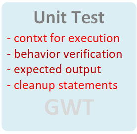
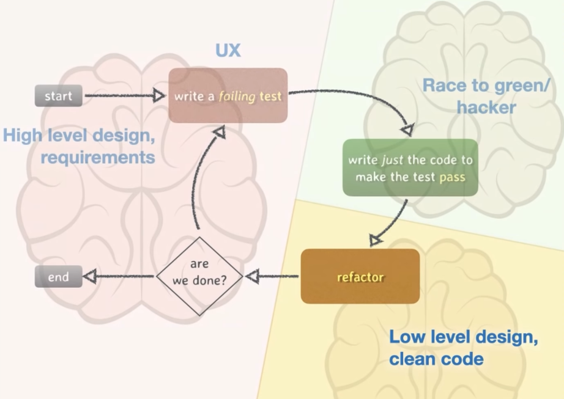

# Modern C++ Programming with Test-Driven Development

## Chapter 3:

  *A unit test verifies the behaviour of a code unit, where a unit is the smallest testable piece of an application.*

  \
  **Unit Test**


  - Write a test to FAILED
  - Listen to your Test
  - Just write the code to make the test PASS.
  - Make the code clean up.
  - Perform the regression testing, to check that we have not broke anything else.
  - After cleaning up the code and doing the regression testing you need to double check if you have done everything correctly as per the requirements.
  - The unit test should run fast no dependency on other units etc.
  - You moves to different mental modes.

  **Test Driven Development (TDD) Cycle**

### Test case execution

```c
/* Command for executing the test */
bazel test --test_output=all //:retweet_test

```
